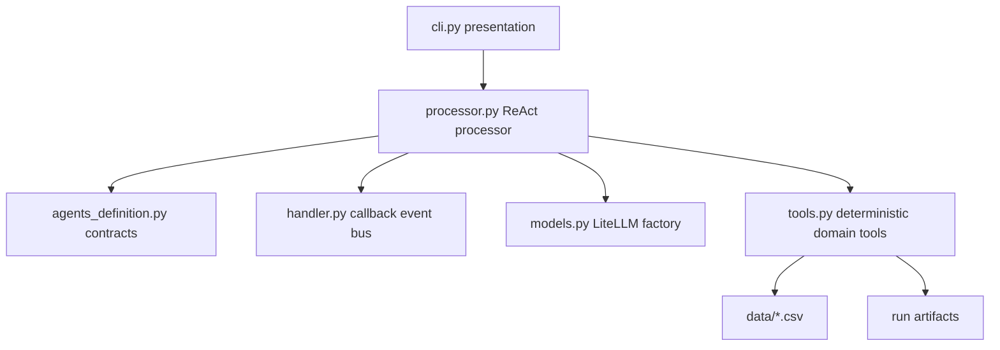
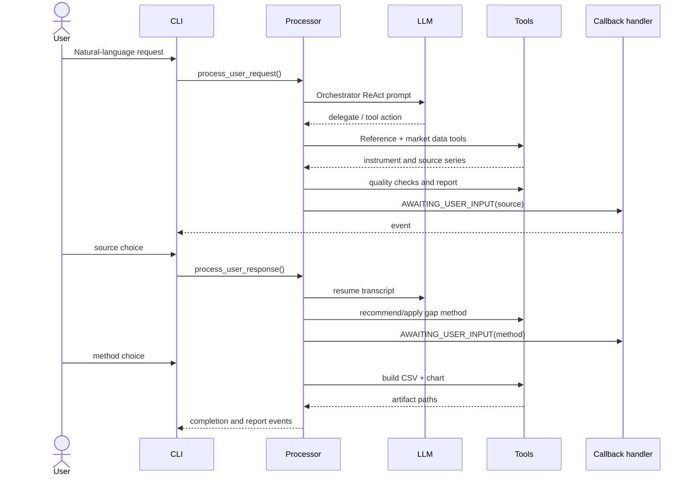

# Time Series Construction Architecture

## Purpose

`time_series_v2` is an AI-assisted workflow for turning a natural-language request such as `Build AAPL from January 2023 to December 2023` into a quality-reviewed continuous financial time series. The system compares the local Yahoo, Bloomberg, and Reuters snapshots, pauses for user decisions, and writes reproducible run artifacts under `~/time_series_construction` by default.

## Design Principles

- **LLM-driven routing:** the Orchestrator chooses specialist delegation through ReAct tool calls. Domain transformations are deterministic Python tools, so an LLM cannot invent prices or silently change calculations.
- **Explicit agent contracts:** all agent names, prompts, and tool permissions live in `agents_definition.py`.
- **Human decisions are events:** source selection and gap-method selection pause the processor through `BaseCallbackHandler`; the CLI is only a consumer of events.
- **Provider neutrality:** `ModelRequestFactory` wraps LiteLLM and accepts Ollama defaults or any LiteLLM-compatible model configured with `LLM_MODEL`, including GitHub/OpenAI-compatible deployments.
- **Artifact-first runs:** every generated CSV, report, chart, and future trace belongs to a run directory. `TIME_SERIES_OUTPUT_DIR` can relocate the root.
- **Testable core:** CSV loading, quality metrics, interpolation, reporting, and plotting are plain functions that can be tested without an LLM.

## Module Boundaries



### `agents_definition.py`

Defines `Agent`, `CallbackEvent`, `CallbackEventType`, the agent registry, prompts, and tool allow-lists. Adding an agent is a registry change plus its tools; the processor does not need a new conditional branch for normal delegation.

### `tools.py`

Owns all financial data access and transformations:

1. Resolve symbols and security names from `instruments.csv`.
2. Load the wide date-indexed source CSVs.
3. Calculate completeness, NaNs, non-positive values, and issue summaries.
4. Recommend and apply interpolation methods.
5. Persist CSV reports, final series, and seaborn charts.

Tools are exposed as LangChain `StructuredTool` instances through `TOOL_REGISTRY`. `request_human_input` intentionally remains a callback operation because it controls processor suspension.

### `processor.py`

Runs the ReAct loop. It sends the current transcript to LiteLLM, parses `Action` / `Action Input` calls, invokes tools, and emits completion or error events. `request_human_input` stores the exact agent, transcript, and next iteration in `paused_state`; `process_user_response` resumes from that state.

The processor does not encode a fixed business state machine. The business sequence is expressed in prompts and tool results, allowing future agents to be inserted without rewriting the facade.

### `handler.py`

`TimeSeriesConstructionCallbackHandler` is both a LangChain callback handler and a small event bus. It provides queue operations, pause/resume state, agent context, and common LLM/tool error events. Additional consumers can be added as handlers without changing tools or the CLI.

### `models.py`

Contains the request value object and LiteLLM factory. Keep provider credentials and model selection in environment configuration; do not place secrets in agent definitions or artifacts.

### `cli.py`

Formats events and owns terminal input. A future Streamlit/API UI should call the same processor methods and subscribe to the same event types rather than duplicate domain logic.

## Workflow



## Run Artifacts

The runtime creates:

```text
~/time_series_construction/
└── run_YYYYMMDD_HHMMSS_<id>/
    ├── quality_report.csv
    ├── final_timeseries.csv
    ├── timeseries.png
    └── trace.jsonl              # reserved for full callback/ReAct trace
```

The output root and run id are injectable so tests and batch jobs can use temporary directories. Artifact paths should be emitted in callback payloads, never inferred by the presentation layer.

## Extension Points

- Add a source connector behind `historical_prices` or split it into a source adapter registry when live APIs are introduced.
- Add quality metrics as pure functions and include their results in the report schema.
- Add a `TraceCallbackHandler` that serializes callback events and sanitized LLM/tool messages to `trace.jsonl` for evaluation and reinforcement-learning datasets.
- Add a web UI or API adapter over `process_user_request` and `process_user_response`.
- Add structured LLM output or LangGraph checkpointing when ReAct text parsing becomes a limitation. The current public processor API can remain stable.

## Operating Constraints

The bundled CSVs are fixture-like snapshots. Bloomberg and Reuters are not live vendor integrations. Production use should add source freshness, licensing, credentials, schema validation, and provenance metadata before treating output as investment-grade data.
