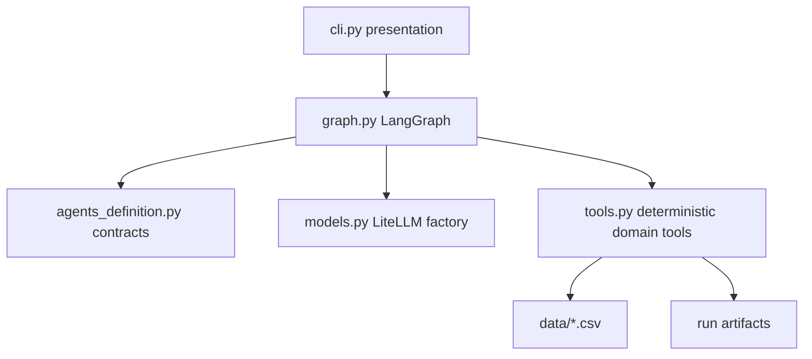
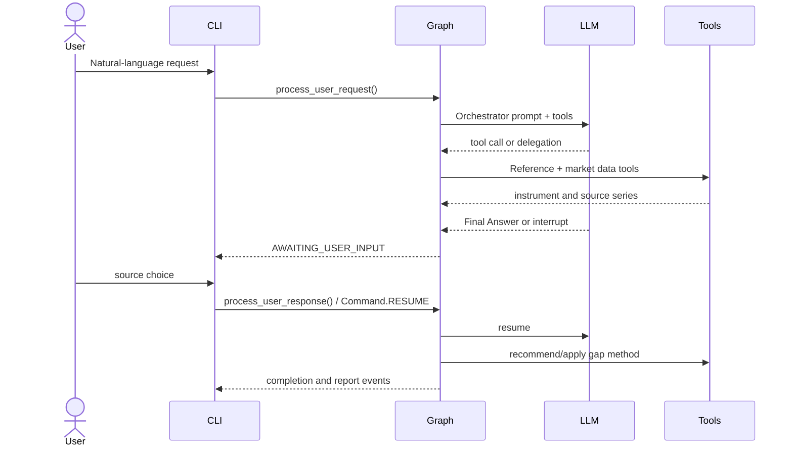

# Time Series Construction Architecture (LangGraph Edition)

## Purpose

`time_series_construction_langgraph` is an AI-assisted workflow for turning a natural-language request such as `Build AAPL from January 2023 to December 2023` into a quality-reviewed continuous financial time series. The system compares the local Yahoo, Bloomberg, and Reuters snapshots, pauses for user decisions, and writes reproducible run artifacts under `~/time_series_construction` by default.

## Design Principles

- **LLM-driven routing:** the Orchestrator chooses specialist delegation through ReAct tool calls. Domain transformations are deterministic Python tools, so an LLM cannot invent prices or silently change calculations.
- **Explicit agent contracts:** all agent names, prompts, and tool permissions live in `agents_definition.py`.
- **Human decisions are interrupts:** source selection and gap-method selection pause the LangGraph execution via `.interrupt()`. The CLI is a consumer of interrupt events.
- **Provider neutrality:** `ModelRequestFactory` wraps LiteLLM and accepts Ollama defaults or any LiteLLM-compatible model configured with `LLM_MODEL`.
- **Artifact-first runs:** every generated CSV, report, chart, and trace belongs to a run directory. `TIME_SERIES_OUTPUT_DIR` can relocate the root.
- **Testable core:** CSV loading, quality metrics, interpolation, reporting, and plotting are plain functions that can be tested without an LLM.
- **LangGraph persistence:** Uses `MemorySaver` checkpoints for state persistence across human-in-the-loop interrupts.

## Module Boundaries



### `agents_definition.py`

Defines `Agent`, `CallbackEvent`, `CallbackEventType`, the agent registry, prompts, and tool allow-lists. Adding an agent is a registry change plus its tools; the graph does not need a new conditional branch for normal delegation.

### `tools.py`

Owns all financial data access and transformations:

1. Resolve symbols and security names from `instruments.csv`.
2. Load the wide date-indexed source CSVs.
3. Calculate completeness, NaNs, non-positive values, and issue summaries.
4. Recommend and apply interpolation methods.
5. Persist CSV reports, final series, and seaborn charts.

Tools are exposed as LangChain `StructuredTool` instances through `TOOL_REGISTRY`.

### `graph.py`

LangGraph `StateGraph` with built-in tool calling support. Key differences from `processor.py`:

- Uses `ToolNode` for tool execution (no regex parsing).
- Uses `.interrupt()` for human-in-the-loop (no custom `paused_state`).
- Uses `MemorySaver` for checkpointing.
- Provides the same `process_user_request` / `process_user_response` API for CLI compatibility.

### `cli.py`

Formats events and owns terminal input. A future Streamlit/API UI should call the same graph methods.

## Workflow



## Run Artifacts

The runtime creates:

```text
~/time_series_construction/
└── run_YYYYMMDD_HHMMSS_<id>/
    ├── quality_report.csv
    ├── final_timeseries.csv
    ├── timeseries.png
    └── trace.jsonl              # reserved for full callback/ReAct trace
```

## Extension Points

- Add a source connector behind `historical_prices` or split it into a source adapter registry when live APIs are introduced.
- Add quality metrics as pure functions and include their results in the report schema.
- Add a `TraceCallbackHandler` that serializes callback events to `trace.jsonl` for evaluation and reinforcement-learning datasets.
- Add a web UI or API adapter over `process_user_request` and `process_user_response`.
- Swap `MemorySaver` for `SqliteSaver` or a database-backed checkpointer for production use.

## Operating Constraints

The bundled CSVs are fixture-like snapshots. Bloomberg and Reuters are not live vendor integrations. Production use should add source freshness, licensing, credentials, schema validation, and provenance metadata before treating output as investment-grade data.